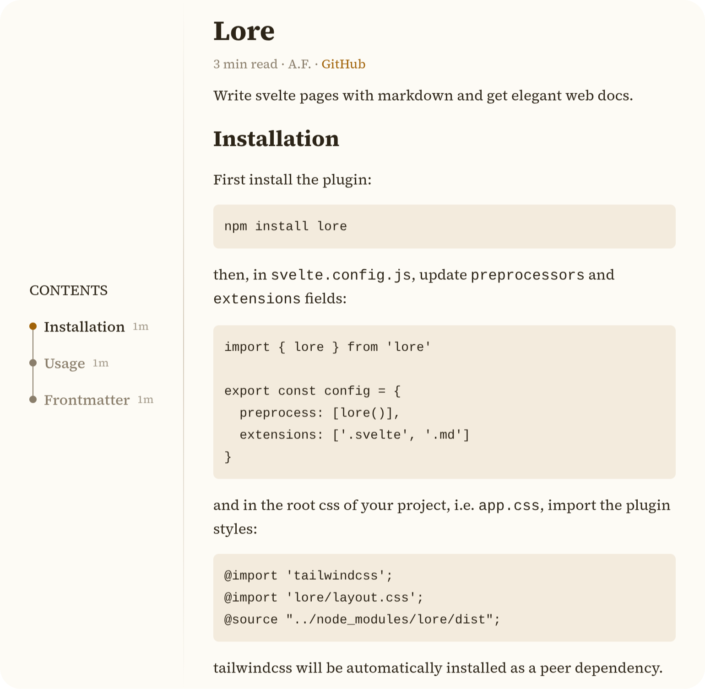

# Lore

Write svelte pages with markdown and get elegant web docs.



## Installation

First install the plugin:

```sh
npm install lore
```

then, in `svelte.config.js`, update `preprocessors` and `extensions` fields:

```js
import { lore } from 'lore'

export const config = {
  preprocess: [lore()],
  extensions: ['.svelte', '.md']
}
```

and in the root css of your project, i.e. `app.css`, import the plugin styles:

```app.css
@import 'tailwindcss';
@import 'lore/layout.css';
@source "../node_modules/lore/dist";
```

tailwindcss will be automatically installed as a peer dependency.

## Usage

Instead of `+page.svelte` files, you write `+page.md` files. Then you can do pretty much
everything you would in a normal markdown file. But also anything you would in
a normal svelte file, like this:

```md
<script>
  import FancyComponent from './FancyComponent.svelte'
  let counter = $state(0)
</script>

# Title

Some description under the title here!

## Section

A **counter**!

<button onclick={() => counter++}>{counter}</button>

And a svelte component

<FancyComponent />

Or some maths :O

$$f(a) = \frac{1}{2\pi i} \oint_{\gamma}\frac{f(z)}{z-a} dz.$$
```

## Frontmatter

At the start of each `+page.md` file you can specify `author` and `github` fields:


```md
---
github: user/repo
author: user
---
```

In markdown, relative links will be relative to the repo link. So, for example

```md
[script](./script.py) 
```

will point to file `script.py` inside the repo `user/repo` on github. The same applies to images.
